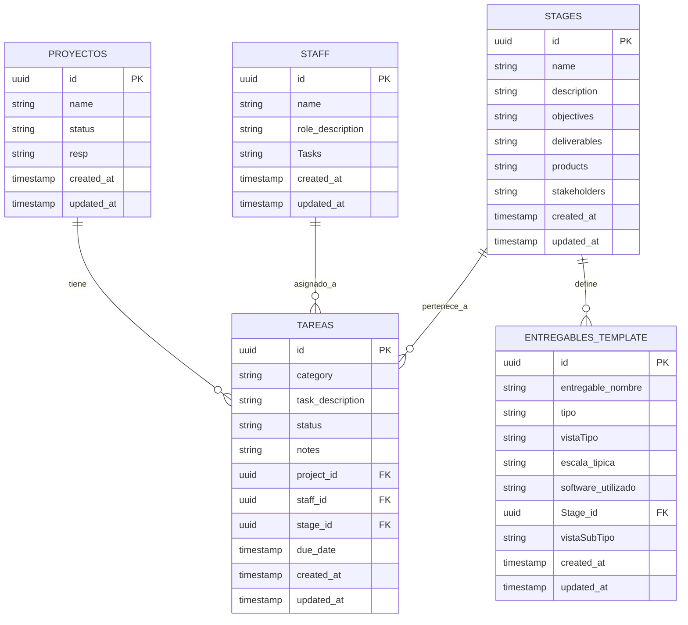

# Arquitectura de Datos - ARQ.TVS

## Descripción General

Este documento describe la estructura de datos utilizada en el sistema ARQ.TVS, un sistema de gestión de proyectos arquitectónicos que utiliza Supabase como backend.

## Tablas Principales

### 1. Proyectos (Proyectos)

Almacena información sobre proyectos arquitectónicos.

```typescript
interface Proyecto {
  id: string;              // UUID - Primary Key
  name: string;            // Nombre del proyecto
  status: string;          // Estado: 'Pendiente' | 'En Progreso' | 'En Diseño' | 'Pausado' | 'Completo'
  resp: string;            // Responsable del proyecto
  created_at: timestamp;   // Fecha de creación
  updated_at: timestamp;   // Última actualización
}
```

**Estados válidos:**
- `Pendiente`: Proyecto no iniciado
- `En Progreso`: Proyecto en ejecución
- `En Diseño`: Fase de diseño
- `Pausado`: Temporalmente detenido
- `Completo`: Proyecto finalizado

### 2. Tareas (Tareas)

Almacena tareas asociadas a proyectos.

```typescript
interface Tarea {
  id: string;                 // UUID - Primary Key
  category: string;           // Categoría de la tarea
  task_description: string;   // Descripción de la tarea
  status: string;             // Estado actual
  notes: string;              // Notas adicionales
  project_id: string;         // Foreign Key -> Proyectos
  staff_id: string;           // Foreign Key -> Staff (asignado)
  stage_id: string;           // Foreign Key -> Stages (etapa)
  created_at: timestamp;      // Fecha de creación
  updated_at: timestamp;      // Última actualización
  due_date: timestamp;        // Fecha límite (opcional)
}
```

**Estados válidos:**
- `Pendiente`: Tarea sin iniciar
- `En Diseño`: En fase de diseño
- `En Progreso`: En ejecución
- `Aprobación Requerida`: Pendiente de aprobación
- `Bloqueado`: Bloqueada por dependencias
- `En Discusión`: Requiere discusión
- `Completo`: Tarea completada

**Categorías válidas:**
- Diseño estructural
- Revisión de diseño
- Puertas
- Baños
- Exterior
- Obra
- Redes
- Interior
- Paisajismo
- Diseño técnico
- Fachada
- Entrega a Curaduría
- Habitación de huéspedes
- Diseño de espacio público
- General
- Acabados

### 3. Staff (Staff)

Personal del equipo.

```typescript
interface Staff {
  id: string;                // UUID - Primary Key
  name: string;              // Nombre completo
  role_description: string;  // Descripción del rol
  Tasks: string;             // Referencias a tareas (puede estar vacío)
  created_at: timestamp;     // Fecha de creación
  updated_at: timestamp;     // Última actualización
}
```

### 4. Etapas (Stages)

Etapas o fases de los proyectos arquitectónicos.

```typescript
interface Stage {
  id: string;              // UUID - Primary Key
  name: string;            // Nombre de la etapa
  description: string;     // Descripción
  objectives: string;      // Objetivos
  deliverables: string;    // Entregables esperados
  products: string;        // Productos
  stakeholders: string;    // Partes interesadas
  created_at: timestamp;   // Fecha de creación
  updated_at: timestamp;   // Última actualización
}
```

### 5. Plantillas de Entregables (Entregables_template)

Plantillas para entregables arquitectónicos.

```typescript
interface EntregableTemplate {
  id: string;                 // UUID - Primary Key
  entregable_nombre: string;  // Nombre del entregable
  tipo: string;               // '2D' | '3D' | '2D/3D'
  vistaTipo: string;          // Tipo de vista
  escala_tipica: string;      // Escala típica (ej: '1:50', '1:100')
  software_utilizado: string; // Software utilizado
  Stage_id: string;           // Foreign Key -> Stages
  vistaSubTipo: string;       // Subtipo de vista
  created_at: timestamp;      // Fecha de creación
  updated_at: timestamp;      // Última actualización
}
```

**Tipos válidos:**
- `2D`: Entregable 2D
- `3D`: Entregable 3D
- `2D/3D`: Mixto

**Tipos de vista válidos:**
- Planta
- Alzado
- Sección
- Perspectiva
- Axonométrica
- Isométrica
- Diagrama
- Plano Urbano
- Sección/Alzado Detallado

**Software válido:**
- Revit
- AutoCAD
- Adobe Suite
- Lumion/VRay
- SketchUp/Revit
- AutoCAD/GIS
- Revit/AutoCAD

## Relaciones entre Tablas

```
Proyectos (1) ----< (N) Tareas
                          |
                          |-- (N) >---- (1) Staff
                          |
                          |-- (N) >---- (1) Stages

Stages (1) ----< (N) Entregables_template
```

### Diagrama de Relaciones



## Índices Recomendados

Para optimizar el rendimiento, se recomiendan los siguientes índices:

### Tareas
- `idx_tareas_project_id` en `project_id`
- `idx_tareas_staff_id` en `staff_id`
- `idx_tareas_stage_id` en `stage_id`
- `idx_tareas_status` en `status`
- `idx_tareas_due_date` en `due_date`

### Proyectos
- `idx_proyectos_status` en `status`

### Entregables
- `idx_entregables_stage_id` en `Stage_id`
- `idx_entregables_tipo` en `tipo`

## Políticas de Seguridad (RLS)

Todas las tablas deben tener Row Level Security (RLS) habilitado en Supabase. Las políticas específicas dependen de los requerimientos de autenticación.

## Migración y Versionado

### Versión Actual: 1.0

**Próximas mejoras:**
- [ ] Añadir campo `priority` a Tareas
- [ ] Añadir timestamps automáticos con triggers
- [ ] Implementar soft delete con campo `deleted_at`
- [ ] Añadir auditoría con tabla de cambios
- [ ] Implementar tags/etiquetas para proyectos y tareas

## Uso en la Aplicación

### Redux Store

Los datos se manejan a través de Redux con los siguientes reducers:

- `projectsReducer` - Gestiona proyectos
- `tasksReducer` - Gestiona tareas
- `staffReducer` - Gestiona personal
- `stagesReducer` - Gestiona etapas
- `entregablesReducer` - Gestiona plantillas de entregables

### Actions

Las acciones CRUD están modularizadas en:

```
src/store/actions/
  ├── projectActions.js     # Acciones para proyectos
  ├── taskActions.js        # Acciones para tareas
  ├── staffActions.js       # Acciones para staff
  ├── stagesActions.js      # Acciones para etapas
  ├── entregablesActions.js # Acciones para entregables
  └── index.js              # Exportación centralizada
```

### Ejemplo de Uso

```javascript
import { fetchProjects, createProject, updateProject } from './store/actions';

// Obtener todos los proyectos
dispatch(fetchProjects());

// Crear un nuevo proyecto
dispatch(createProject({
  name: 'Nuevo Proyecto',
  status: 'Pendiente',
  resp: 'Juan Pérez'
}));

// Actualizar proyecto
dispatch(updateProject(projectId, { 
  status: 'En Progreso' 
}));
```

## Notas Importantes

1. **UUIDs**: Todas las tablas usan UUIDs como primary keys para mejor escalabilidad y seguridad.

2. **Timestamps**: Los campos `created_at` y `updated_at` se gestionan automáticamente por Supabase.

3. **Cascading Deletes**: Las eliminaciones deben manejarse con cuidado para mantener integridad referencial.

4. **Validación**: La validación de datos se realiza tanto en frontend (types/database.js) como en backend (Supabase constraints).

## Referencias

- **Esquemas TypeScript**: `src/types/database.js`
- **Configuración Supabase**: `SUPABASE_SETUP_COMPLETED.md`
- **Documentación del Proyecto**: `PROYECTO_ARQ_DOCUMENTACION.md`
