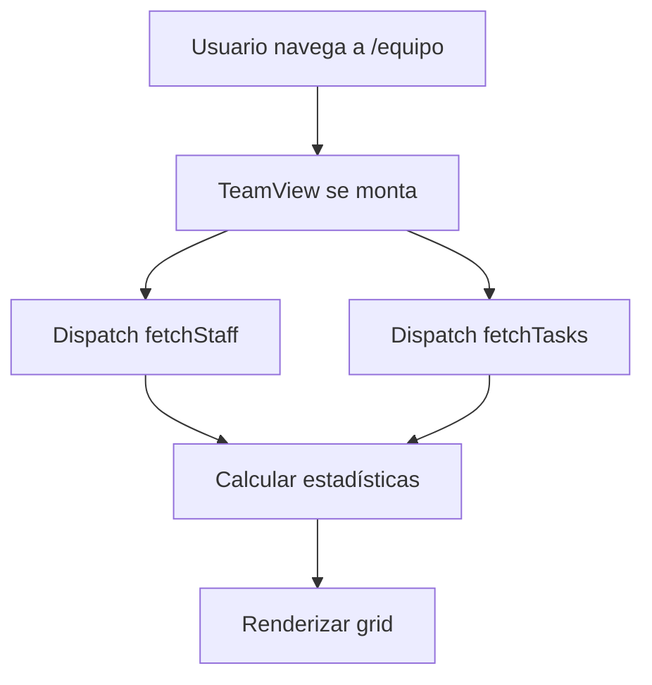
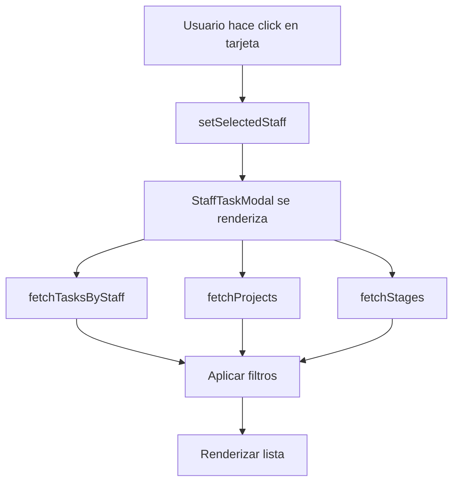
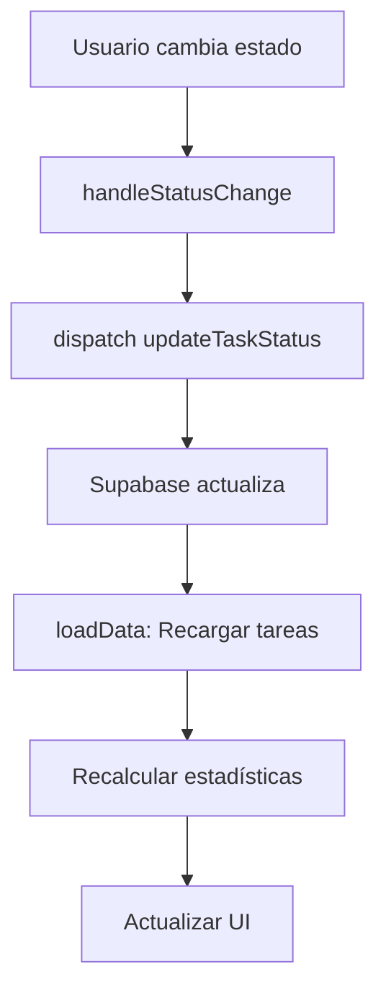

# 👥 Vista de Equipo - Gestión de Tareas por Persona

## 📋 Descripción

Nueva funcionalidad que permite visualizar y gestionar las tareas de cada miembro del equipo de forma individualizada. Facilita el seguimiento del progreso y carga de trabajo de cada persona.

---

## ✨ Características Principales

### 1. Grid de Miembros del Equipo

**Vista Principal:** Muestra tarjetas con información de cada miembro:
- **Avatar inicial** con la primera letra del nombre
- **Nombre completo** y **rol**
- **Barra de progreso** visual del porcentaje de tareas completadas
- **Estadísticas rápidas:**
  - Total de tareas asignadas
  - Tareas completadas
  - Tareas pendientes
  - Tareas en progreso
  - Tareas bloqueadas

### 2. Modal de Tareas Individuales (StaffTaskModal)

Al hacer clic en un miembro del equipo, se abre un modal completo con:

#### Header
- Avatar y nombre del miembro
- Rol o descripción del puesto
- Botón de cerrar

#### Barra de Estadísticas
- **Total** de tareas
- **Pendientes** (color naranja)
- **En Curso** (color azul)
- **Completadas** (color verde)
- **Bloqueadas** (color rojo, solo si hay)

#### Filtros y Ordenamiento
- **Filtrar por estado:** Todos, Pendiente, En Diseño, En Progreso, etc.
- **Ordenar por:**
  - Estado
  - Proyecto
  - Etapa

#### Lista de Tareas
Cada tarea muestra:
- **Badge de estado** con color e ícono
- **Categoría** de la tarea
- **Descripción** completa
- **Proyecto** asociado
- **Etapa** actual
- **Notas** (si existen)
- **Selector de estado** para cambio rápido
- **Botón de eliminar**

---

## 🎯 Casos de Uso

### 1. Supervisor revisa carga de trabajo
```
Usuario: Supervisor de Proyecto
Acción: Revisa la vista de Equipo
Resultado: Ve rápidamente quién está sobrecargado y quién tiene capacidad
```

### 2. Miembro del equipo revisa sus tareas
```
Usuario: Arquitecto
Acción: Hace clic en su tarjeta
Resultado: Ve todas sus tareas, filtra por pendientes, actualiza estados
```

### 3. Gestión de tareas bloqueadas
```
Usuario: Project Manager
Acción: Identifica tarjetas con tareas bloqueadas (badge rojo)
Resultado: Abre el modal, filtra por bloqueadas, gestiona desbloqueos
```

### 4. Distribución de carga
```
Usuario: Coordinador
Acción: Revisa progreso de cada miembro
Resultado: Identifica desequilibrios y reasigna tareas
```

---

## 📊 Estructura de Datos

### Staff (Equipo)
```typescript
interface Staff {
  id: string;              // UUID
  name: string;            // Nombre completo
  role_description: string; // Descripción del rol
  Tasks: string;           // Referencias (legacy)
}
```

### Tasks (Tareas)
```typescript
interface Task {
  id: string;
  category: string;
  task_description: string;
  status: string;
  notes: string;
  project_id: string;      // FK -> Proyectos
  staff_id: string;        // FK -> Staff ⭐
  stage_id: string;        // FK -> Stages
}
```

**Estados de Tarea:**
- Pendiente
- En Diseño
- En Progreso
- Aprobación Requerida
- Bloqueado
- En Discusión
- Completo

---

## 🔧 Componentes

### 1. `TeamView.jsx`
**Ubicación:** `src/components/TeamView.jsx`

**Responsabilidades:**
- Cargar lista de staff desde Supabase
- Cargar todas las tareas
- Calcular estadísticas por persona
- Renderizar grid de tarjetas
- Manejar apertura del modal

**Actions utilizadas:**
```javascript
import { fetchStaff, fetchTasks } from '../store/actions/actions';

// Cargar datos
dispatch(fetchStaff());
dispatch(fetchTasks());
```

**Estadísticas calculadas:**
```javascript
{
  total: number,
  pending: number,
  inProgress: number,
  completed: number,
  blocked: number,
  completionRate: number // 0-100%
}
```

### 2. `StaffTaskModal.jsx`
**Ubicación:** `src/components/StaffTaskModal.jsx`

**Responsabilidades:**
- Mostrar tareas del staff seleccionado
- Filtrar y ordenar tareas
- Permitir cambio de estado
- Permitir eliminación de tareas

**Actions utilizadas:**
```javascript
import { 
  fetchTasksByStaff,
  updateTaskStatus,
  deleteTask,
  fetchProjects,
  fetchStages
} from '../store/actions/actions';

// Cargar tareas del staff
dispatch(fetchTasksByStaff(staffId));

// Actualizar estado
dispatch(updateTaskStatus(taskId, newStatus));

// Eliminar tarea
dispatch(deleteTask(taskId));
```

---

## 🎨 Diseño Visual

### Colores por Estado

| Estado | Color de Fondo | Color de Texto | Borde |
|--------|----------------|----------------|-------|
| **Pendiente** | Gray-100 | Gray-800 | Gray-300 |
| **En Diseño** | Purple-100 | Purple-800 | Purple-300 |
| **En Progreso** | Blue-100 | Blue-800 | Blue-300 |
| **Aprobación Requerida** | Orange-100 | Orange-800 | Orange-300 |
| **Bloqueado** | Red-100 | Red-800 | Red-300 |
| **En Discusión** | Yellow-100 | Yellow-800 | Yellow-300 |
| **Completo** | Green-100 | Green-800 | Green-300 |

### Iconos por Estado

- ✅ **Completo:** CheckCircle
- ⚠️ **Bloqueado:** AlertTriangle
- 🕐 **Pendiente:** Clock
- 💼 **En Progreso:** Briefcase

### Grid Layout

- **Mobile:** 1 columna
- **Tablet (md):** 2 columnas
- **Desktop (lg):** 3 columnas

---

## 🚀 Flujo de Trabajo

### Cargar Vista de Equipo



### Abrir Modal de Tareas



### Actualizar Estado de Tarea



---

## 📝 Ejemplos de Uso

### Ejemplo 1: Filtrar tareas pendientes de un arquitecto

```javascript
// El usuario:
1. Hace clic en la tarjeta del arquitecto
2. Se abre el modal con todas sus tareas
3. Selecciona "Pendiente" en el filtro
4. Ve solo las tareas pendientes ordenadas por prioridad
```

### Ejemplo 2: Cambiar estado de tarea

```javascript
// En el modal:
1. Localiza la tarea en la lista
2. Hace clic en el selector de estado
3. Selecciona "En Progreso"
4. La tarea se actualiza automáticamente
5. Las estadísticas se recalculan
```

### Ejemplo 3: Identificar cuellos de botella

```javascript
// En la vista de equipo:
1. El supervisor ve las tarjetas
2. Nota que Juan tiene 15 tareas totales, 5 bloqueadas
3. Hace clic en su tarjeta
4. Filtra por "Bloqueado"
5. Revisa qué está bloqueando y gestiona
```

---

## 🔄 Integración con Sistema Existente

### Actions utilizadas
Todas importadas desde el sistema unificado:
```javascript
import {
  fetchStaff,
  fetchTasks,
  fetchTasksByStaff,
  updateTaskStatus,
  deleteTask,
  fetchProjects,
  fetchStages
} from '../store/actions/actions';
```

### Compatibilidad
- ✅ Usa el sistema modular de Redux
- ✅ Compatible con todas las tablas de Supabase
- ✅ No requiere cambios en la estructura de datos
- ✅ Se integra con la navegación modular

---

## 🎓 Mejores Prácticas

### 1. Para Usuarios

- **Revisa regularmente** tu carga de trabajo
- **Actualiza estados** de tareas frecuentemente
- **Usa filtros** para enfocarte en prioridades
- **Marca como bloqueado** cuando necesites ayuda

### 2. Para Supervisores

- **Revisa el grid** diariamente para balancear carga
- **Identifica tareas bloqueadas** rápidamente
- **Monitorea porcentajes** de completitud
- **Reasigna tareas** cuando sea necesario

### 3. Para Desarrollo

- **El componente es reutilizable** - puede adaptarse para otros usos
- **Los filtros son extensibles** - agregar más filtros es sencillo
- **Las estadísticas son recalculables** - fácil añadir nuevas métricas
- **Modal es independiente** - puede usarse en otros contextos

---

## 🐛 Troubleshooting

### Las tareas no se cargan

**Problema:** El modal está vacío
**Solución:** 
- Verificar que el staff_id en las tareas coincida con el id del staff
- Revisar console.log para errores de Supabase

### Las estadísticas no se actualizan

**Problema:** Los números en las tarjetas son incorrectos
**Solución:**
- Llamar a `loadData()` después de cualquier cambio
- Verificar que `calculateStats()` reciba los datos correctos

### El modal no se cierra

**Problema:** El modal queda abierto
**Solución:**
- Verificar que `onClose` esté siendo llamado
- Revisar que `setSelectedStaff(null)` se ejecute

---

## 🔮 Futuras Mejoras

### Corto Plazo
- [ ] Agregar creación de tareas desde el modal
- [ ] Permitir edición in-line de descripciones
- [ ] Añadir filtro por proyecto
- [ ] Exportar lista de tareas a Excel

### Mediano Plazo
- [ ] Gráfico de distribución de carga
- [ ] Timeline de tareas completadas
- [ ] Notificaciones de tareas vencidas
- [ ] Chat por tarea (comentarios)

### Largo Plazo
- [ ] Vista de calendario por persona
- [ ] Estimación de horas y tracking
- [ ] Reportes de productividad
- [ ] Integración con sistemas externos

---

## 📚 Referencias

- **Componentes:** `TeamView.jsx`, `StaffTaskModal.jsx`
- **Actions:** `src/store/actions/actions.js`
- **Tipos:** `src/types/database.js`
- **Navegación:** `src/config/navigationConfig.js`
- **Documentación General:** `REFACTORIZACION.md`
- **Guía de Actions:** `GUIA_ACTIONS.md`

---

**Versión:** 1.0.0  
**Fecha:** 2025-01-27  
**Autor:** Equipo ARQ.TVS
